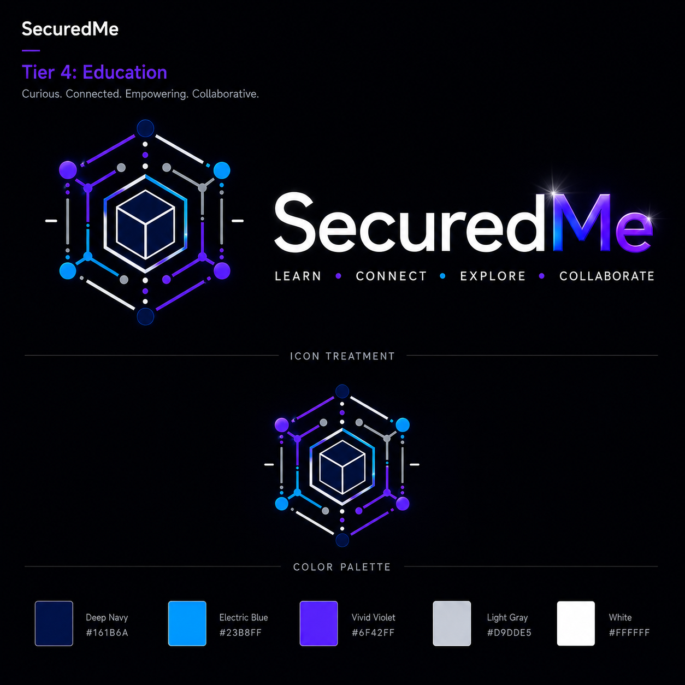

# AlgoQuest Discovery Labs

<section class="se-tool-hero" aria-label="AlgoQuest Discovery Labs">
  <picture>
    
    
  </picture>
  

    <picture>
      
      
    </picture>
    
SecuredMe Education

    <h2>Play with algorithms through guided challenges and visual checkpoints.</h2>
    
Students who learn best by trying, comparing, and improving.

  

</section>

## What You Can Do

Use this tool to move from a learning question to a visible artifact: a plan, sketch, checklist, reflection, or classroom activity.

## First Step

Pick one everyday task and turn it into five clear steps.

## Try A Starter Prompt

Use the [40 Starter Prompts](starter-prompts/index.md) to adapt this tool to your learning goal.

## Next Fabrication Step

Keep the result, name what improved, and choose one small thing to build next.
