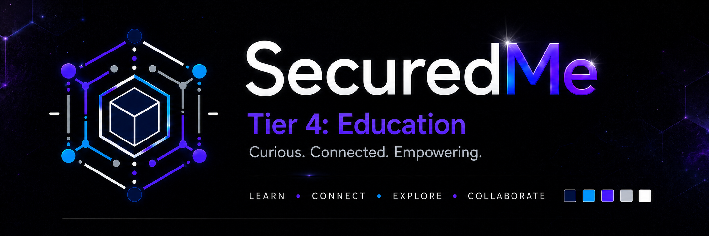

# SecuredMe Education

SecuredMe Education is a public learning suite for students, teachers, and creators who want practical tools, visible progress, and a calmer way to begin.

  <a class="se-action-link" href="algoquest/">Start With AlgoQuest</a>
  <a class="se-action-link" href="tools/">Tool Index</a>
  <a class="se-action-link" href="starter-prompts/">40 Starter Prompts</a>
  <a class="se-action-link" href="notebooks/">Notebook / Colab</a>
  <a class="se-action-link" href="accessibility/edge-user-console/">Access Console</a>

## What This Suite Is

  <section class="se-public-card se-public-card--compact">
    
Learn

    <h2>Start Small</h2>
    
Pick one tool and one activity.

  </section>
  <section class="se-public-card se-public-card--compact">
    
Connect

    <h2>Use A Prompt</h2>
    
Turn a question into a result.

  </section>
  <section class="se-public-card se-public-card--compact">
    
Explore

    <h2>Open A Path</h2>
    
Move from idea to tool to artifact.

  </section>
  <section class="se-public-card se-public-card--compact">
    
Access

    <h2>Adjust Comfort</h2>
    
Use calmer reading and focus settings.

  </section>

## First Tool

<section class="se-feature-tool">
  <picture class="se-feature-tool__media">
    
    
  </picture>
  

    
Tool 01

    <h2>AlgoQuest Discovery Labs</h2>
    
Play with algorithms through guided challenges, everyday examples, and visual checkpoints.

    

      <a class="se-action-link" href="algoquest/">Open Tool Page</a>
      <a class="se-action-link" href="starter-prompts/">Use A Starter Prompt</a>
      <a class="se-action-link" href="notebooks/">Open Notebook</a>
    

  

</section>

## Start In 15 Minutes

| Step | Action | Link |
| ---: | --- | --- |
| 1 | Pick one everyday task. | [Open AlgoQuest](algoquest.md) |
| 2 | Turn the task into five steps. | [Prompt Matrix](starter-prompts/index.md) |
| 3 | Draw a simple flow: input, action, result. | [Tool Index](tools/index.md) |
| 4 | Keep the clearest result and choose one next move. | [Access Console](accessibility/edge-user-console.md) |

## Suite Index

The full suite stays available, but the recommended first path is AlgoQuest.

| Tool | Best First Use |
| --- | --- |
| [AlgoQuest Discovery Labs](algoquest.md) | Play with algorithms through guided challenges and visual checkpoints. |
| [Algorithm Builder](algorithm-builder.md) | Turn a learning idea into a clear step-by-step plan. |
| [CeLeBrUm Learning Lab](celebrum-learning-lab.md) | Plan goals, organize reflection, and turn study momentum into next steps. |
| [FFeD QLC](ffed-qlc.md) | Explore quality, logic, and learning checks through structured activities. |
| [FNP-QNN MVP](fnp-qnn-mvp.md) | Explore quantum-inspired learning models with visual, classroom-friendly prompts. |
| [Hippo Memory Learning](hippo-memory-learning.md) | Study how memory-inspired learning can support research and review. |
| [Market Guardian](market-guardian.md) | Understand retail safety, stock awareness, and practical decision checks. |
| [QuaNThoR](quanthor.md) | Explore quantum-inspired reasoning through accessible learning experiments. |
| [SCL License](scl-license.md) | Read the shared education license language for the suite. |
| [SecuredMe Scholarium](scholarium.md) | Support classroom learning paths, teacher review, and student progress. |
| [Synthia](synthia.md) | Guide learning conversations, reflection, and clear next actions. |
| [Tesla Recovery Workbench](tesla-recovery-workbench.md) | Study invention, recovery, and experiment planning through guided activities. |
| [V.O.T Guardian](vot-guardian.md) | Practice visual observation and trust thinking with learner-friendly examples. |
| [Visual Algorithm Designer](visual-algorithm-designer.md) | Sketch algorithm steps visually before turning them into implementation tasks. |
