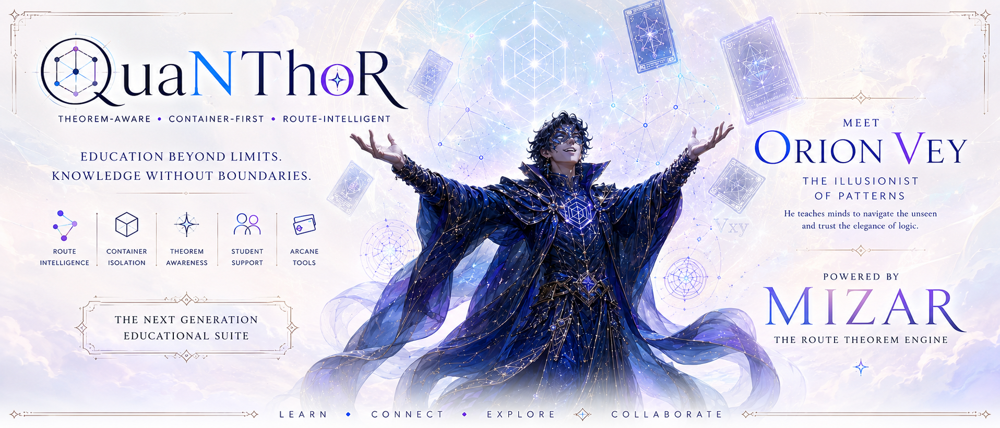

# Tools

Each page below explains what the tool is for, who it helps, and how to start with one practical activity.

## Start Here

<section class="se-feature-tool se-feature-tool--compact">
  <picture class="se-feature-tool__media">
    
    
  </picture>
  

    
Tool 01

    <h2>AlgoQuest Discovery Labs</h2>
    
Begin here if you want a friendly first activity: choose a task, split it into steps, and keep a small visible result.

    

      <a class="se-action-link" href="../algoquest/">Open AlgoQuest</a>
      <a class="se-action-link" href="../starter-prompts/">Choose A Prompt</a>
    

  

</section>

<a class="se-tool-card" href="../algoquest/">
  <picture>
    
    
  </picture>
  
    
Education Tool

    <h2>AlgoQuest Discovery Labs</h2>
    
Play with algorithms through guided challenges and visual checkpoints.

  
</a>

<a class="se-tool-card" href="../algorithm-builder/">
  <picture>
    
    
  </picture>
  
    
Education Tool

    <h2>Algorithm Builder</h2>
    
Turn a learning idea into a clear step-by-step plan.

  
</a>

<a class="se-tool-card" href="../celebrum-learning-lab/">
  <picture>
    
    
  </picture>
  
    
Education Tool

    <h2>CeLeBrUm Learning Lab</h2>
    
Plan goals, organize reflection, and turn study momentum into next steps.

  
</a>

<a class="se-tool-card" href="../ffed-qlc/">
  <picture>
    
    
  </picture>
  
    
Education Tool

    <h2>FFeD QLC</h2>
    
Explore quality, logic, and learning checks through structured activities.

  
</a>

<a class="se-tool-card" href="../fnp-qnn-mvp/">
  <picture>
    
    
  </picture>
  
    
Education Tool

    <h2>FNP-QNN MVP</h2>
    
Explore quantum-inspired learning models with visual, classroom-friendly prompts.

  
</a>

<a class="se-tool-card" href="../hippo-memory-learning/">
  <picture>
    
    
  </picture>
  
    
Education Tool

    <h2>Hippo Memory Learning</h2>
    
Study how memory-inspired learning can support research and review.

  
</a>

<a class="se-tool-card" href="../market-guardian/">
  <picture>
    
    
  </picture>
  
    
Education Tool

    <h2>Market Guardian</h2>
    
Understand retail safety, stock awareness, and practical decision checks.

  
</a>

<a class="se-tool-card" href="../quanthor/">
  <picture>
    
    
  </picture>
  
    
Education Tool

    <h2>QuaNThoR</h2>
    
Explore quantum-inspired reasoning through accessible learning experiments.

  
</a>

<a class="se-tool-card" href="../scl-license/">
  <picture>
    
    
  </picture>
  
    
Education Tool

    <h2>SCL License</h2>
    
Read the shared education license language for the suite.

  
</a>

<a class="se-tool-card" href="../scholarium/">
  <picture>
    
    
  </picture>
  
    
Education Tool

    <h2>SecuredMe Scholarium</h2>
    
Support classroom learning paths, teacher review, and student progress.

  
</a>

<a class="se-tool-card" href="../synthia/">
  <picture>
    
    
  </picture>
  
    
Education Tool

    <h2>Synthia</h2>
    
Guide learning conversations, reflection, and clear next actions.

  
</a>

<a class="se-tool-card" href="../tesla-recovery-workbench/">
  <picture>
    
    
  </picture>
  
    
Education Tool

    <h2>Tesla Recovery Workbench</h2>
    
Study invention, recovery, and experiment planning through guided activities.

  
</a>

<a class="se-tool-card" href="../vot-guardian/">
  <picture>
    
    
  </picture>
  
    
Education Tool

    <h2>V.O.T Guardian</h2>
    
Practice visual observation and trust thinking with learner-friendly examples.

  
</a>

<a class="se-tool-card" href="../visual-algorithm-designer/">
  <picture>
    
    
  </picture>
  
    
Education Tool

    <h2>Visual Algorithm Designer</h2>
    
Sketch algorithm steps visually before turning them into implementation tasks.

  
</a>

